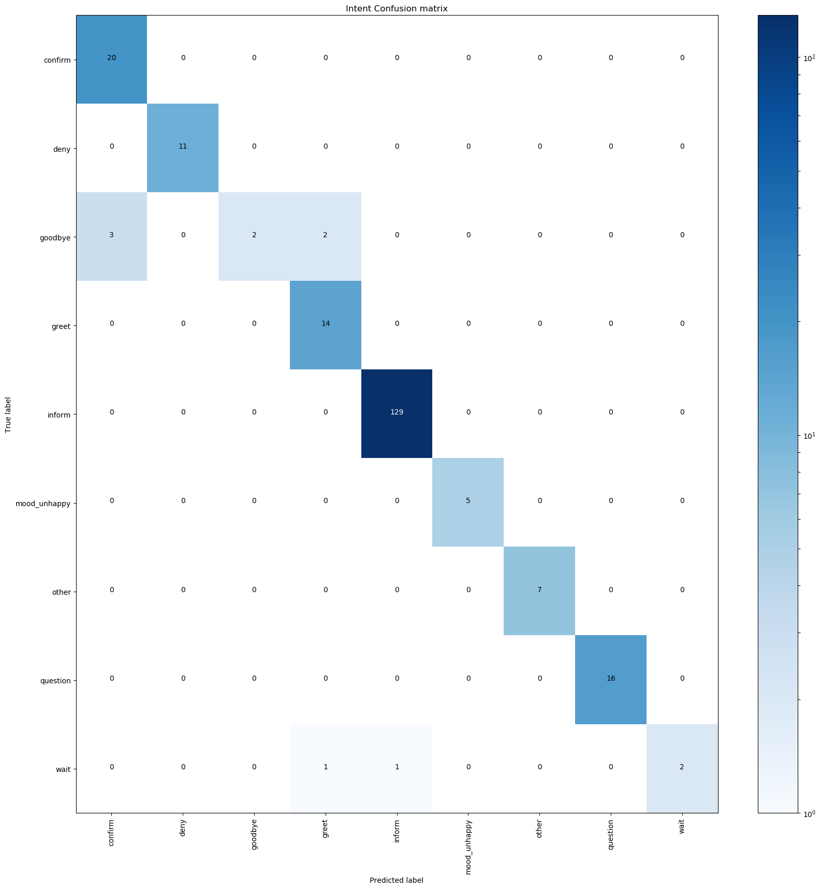
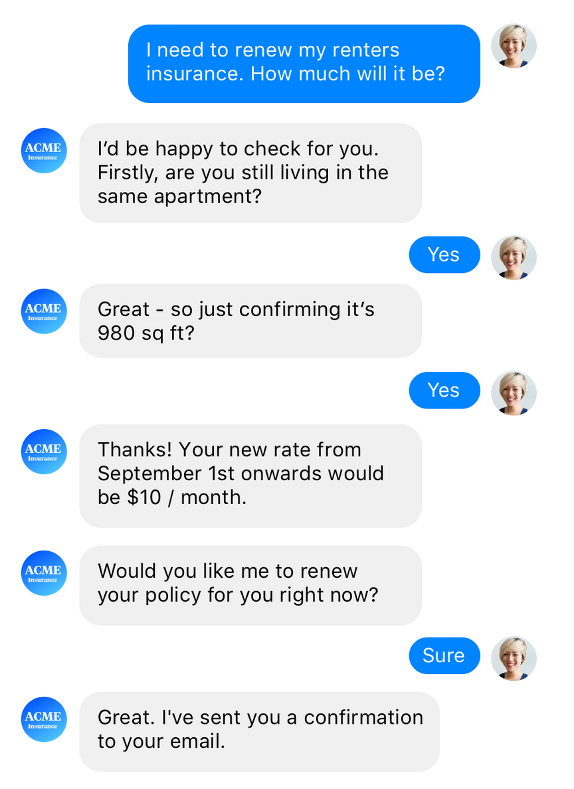

# RASA STACK Chatbot

## Anwedungsbeispiel: Fahrraddiebstahl melden

> [Case von der RASA-Website](https://www.rasa.com/customers/helvetia-claims): Dein Fahrrad wurde bei dir zuhause gestohlen und du möchtest das deiner Versicherung mitteilen.


## Used RASA STACK Versions

- Rasa NLU version: 0.13.8
- Rasa Core version: 0.12.2
----
----
# Installation

## Requirements: Stack and Spacy
Neue virtual environement named *rasabot* und [libaries](requirements.txt) installieren mit Hilfe des [virutalenvwrappers](https://virtualenvwrapper.readthedocs.io/en/latest/install.html). Root Privilegien nötig, d.h. unter windows Konsole als Administrator starten.

```python
pip install virtualenvwrapper
mkvirtualenv rasabot
pip install -r requirements.txt
python -m spacy download "de" 
```

## RASA NLU Trainer
Um Trainingsdaten einfach eingeben und annotieren zu können, hilft der [RASA NLU Trainer](https://github.com/RasaHQ/rasa-nlu-trainer)

- Install [Node.js](https://nodejs.org/en/download/)
    - [Windows-Installer](https://nodejs.org/dist/v8.12.0/node-v8.12.0-x64.msi)
- start new (!) terminal and run
    ```
    npm i -g rasa-nlu-trainer
    ```

## Duckling
Um Datumsangaben in ein standardisiertes Format zu übertragen, kann [duckling](https://duckling.wit.ai/#try-it-out) verwendet werden. 

Duckling als Mirkoservice über Docker:

1. [Docker-Desktop](https://www.docker.com/products/docker-desktop) installieren, um einen *localhost* aufzusetzen.

2. Duckling Server über Docker-Image starten in Konsole:

    ```
    docker run -p 8000:8000 rasa/duckling
    ```

Mehr Infos in den [RASA NLU Docs](https://rasa.com/docs/nlu/components/#ner-duckling-http).

----
----
# RASA NLU
Neuste Version: [](https://badge.fury.io/py/rasa_nlu)
-  Dokumentation für hier verwendete Version 0.13.8: https://rasa.com/docs/nlu/0.13.8/

##  Trainingsdaten NLU: INPUT Formate
- NLU-Model-Training Data wird als JSON gespeichert
    - Beispiele hinzufügen über RASA NLU Trainer (z.Z. nur für Chrome-Browser, erste Datei in Ordner wird ausgesucht)
    ```
    rasa-nlu-trainer 
    ```
    und mit explizieter Quellen-Angabe:
    ```
    rasa-nlu-trainer --source data\data.json
    ```    

- Daten für NLU-Modell liegen unter [data/data.json](data/data.json). Die Daten können als in leichter lesbarer Form als Markdown-Dokument exportiert werden mit Hilfe des kurzen Skriptes [`json_to_md.py`](json_to_md.py):

    ```
    python json_to_md.py
    ```

    Die Datei findet sich dann unter [`data/data.md`](data/data.md)

## Train NLU Model
RASA NLU Model wird ausführlich in [Konfiguration-Datei](config_nlu.yml) definiert. Verschiede [Pipelines](https://rasa.com/docs/nlu/0.13.8/choosing_pipeline/) und Formate sind verfügbar.
```
python train_nlu_model.py
```

## NLU Model Evaluation: Cross-Validation

### Crossvalidation
Überprüfung der Performance des NLU-Models durch Cross Validierung :

```
python -m rasa_nlu.evaluate --data data/data.json --config config_nlu.yml --mode crossvalidation 
```

> [Note](https://rasa.com/docs/nlu/0.13.8/evaluation/#intent-classification): A confusion matrix will only be created if you are evaluating a model on a test set. In cross-validation mode, the confusion matrix will not be generated.

### Training Datensatz

```
python -m rasa_nlu.evaluate --data data/data.json --model models/nlu/default/versicherung_nlu --confmat results/nlu_traindata_confmat.png --histogram results/nlu_traindata_hist.png --errors results/nlu_traindata_errors.json
```

gibt eine [Confusion Matrix](results/nlu_traindata_confmat.png), ein [Histogram](results/nlu_traindata_hist.png) zum Niveau der Sicherheit bei der Intent Klassifikation und eine [JSON-Datei](results/nlu_traindata_errors.json) mit den Fehlern. Die Entity-Klassifikations-Metriken werden nur in der Kommando-Zeile ausgegeben: 

-----------------------


> *wait* intent muss überarbeitet oder gelöscht werden
----------------------


> Definiere ein "Sicherheitslevel" auf Basis des Plots für die Fallback Policy
>    - ab ca. 0.5 sind die Vorhersagen auf den Trainingsdaten immer richtig ("eindeutig")
-----------------
Enitity-Metriken (muss manuell geupdated werden):
```
        - entity examples: 147 (7 distinct entities)
        - found entities: 'case', 'policy_no', 'location', 'birthdate', 'policy_detail', 'object', 'policy'

2018-11-28 14:34:03 INFO     __main__  - Entity evaluation results:
2018-11-28 14:34:03 INFO     __main__  - Evaluation for entity extractor: ner_crf
2018-11-28 14:34:03 INFO     __main__  - F1-Score:  0.9993241287305591
2018-11-28 14:34:03 INFO     __main__  - Precision: 0.9993363762908292
2018-11-28 14:34:03 INFO     __main__  - Accuracy:  0.9993201903467029
2018-11-28 14:34:03 INFO     __main__  - Classification report:
               precision    recall  f1-score   support

    birthdate       1.00      1.00      1.00       180
         case       0.98      1.00      0.99        41
     location       1.00      1.00      1.00        73
    no_entity       1.00      1.00      1.00      1084
       object       1.00      1.00      1.00        32
       policy       1.00      1.00      1.00        11
policy_detail       1.00      1.00      1.00        37
    policy_no       1.00      1.00      1.00        13

  avg / total       1.00      1.00      1.00      1471
``` 
> Welcher Support (Anzahl der Trainingdatenbeispiele) sollte erhöht werden?
> - Entity-Evaluierung noch eher schwierig möglich 
> - Gibt es Falsch-Positive?
----

### Test Datensatz

Test-Daten unter [`data/extracted/testdata_nlu.md`](data/extracted/testdata_nlu.md).
    
```
python -m rasa_nlu.evaluate --data data/extracted/testdata_nlu.md --model models/nlu/default/versicherung_nlu --confmat results/nlu_testdata_confmat.png --histogram results/nlu_testdata_hist.png --errors results/nlu_testdata_errors.json
```
Fehler, s. [`results/nlu_testdata_errors.json`](results/nlu_testdata_errors.json)


----------------------


-----------------
Enitity-Metriken (muss manuell geupdated werden):
```
        - entity examples: 76 (5 distinct entities)
        - found entities: 'policy_no', 'location', 'birthdate', 'object', 'case'

2018-11-28 14:32:42 INFO     __main__  - Entity evaluation results:
2018-11-28 14:32:42 INFO     __main__  - Evaluation for entity extractor: ner_crf
2018-11-28 14:32:42 INFO     __main__  - F1-Score:  0.9441717701812947
2018-11-28 14:32:42 INFO     __main__  - Precision: 0.9487969122115464
2018-11-28 14:32:42 INFO     __main__  - Accuracy:  0.9479166666666666
2018-11-28 14:32:42 INFO     __main__  - Classification report:
             precision    recall  f1-score   support

  birthdate       1.00      1.00      1.00        19
       case       0.87      0.76      0.81        17
   location       1.00      0.53      0.70        15
  no_entity       0.95      0.98      0.97       197
     object       0.91      0.95      0.93        21
  policy_no       1.00      1.00      1.00        19

avg / total       0.95      0.95      0.94       288
```
-----
-----
# RASA Core
Neuste Version: [](https://pypi.python.org/pypi/rasa-core)
- Dokumentation für hier verwendete Version 0.12.2: https://rasa.com/docs/core/0.12.2/ 

## Trainingsdialogue
Rasa Core, d.h. das Dialog-Ablauf-Model, wird auf Basis von sogenannten Stories trainiert. Ein Trainingsdialog besteht aus Bot-Aktionen sowie User-Intents und Entities. Die Trainingsdaten für das Dialog-Model sind damit abstrahierte sprachliche Einheiten, die zur Laufzeit des Bots vom NLU-Modell bereitgestellt werden.

Das [Dateiformat der Stories](https://rasa.com/docs/core/0.12.2/stories/), erlaubt es mehrere Stories in einer zusammenzufassen, dank 
- [checkpoints](https://rasa.com/docs/core/0.12.2/stories/#checkpoints)
- [OR statements](https://rasa.com/docs/core/0.12.2/stories/#or-statements)

## Rasa Core Model trainieren
Um ein Modell abstrakt zu trainieren, werden 
    
- Stories unter [`data/stories.md`](data/stories.md) als Trainingsdaten verwendet, und
- die dem Bot bekannten Intents, Entities (Slots) und Aktionen in der [`domain.yml`](domain.yml) definiert.

```
python train_dialogue_model.py
```

[`train_dialogue_model.py`](train_dialogue_model.py) implementiert die [`train_dialogue`](train_dialogue_model.py)  Funktion, die importiert werden kann.


## Rasa Core Model in der Kommandozeile 
Um den Bot nutzen zu können muss eine Anwendung im Hintergrund laufen, die benutzerdefinierte Bot-Antworten erstellt. Diese Custom-Bot-Antworten werden in [`actionserver/actions.py`](actionserver/actions.py) definiert. Dann muss der Chat-Bot mit einem vortrainierten Sprach-Model geladen werden, damit User Inputs verstanden werden.

1. Kommandozeile: Start *custom action server*:  

    ```
    python -m rasa_core_sdk.endpoint --actions actionserver.actions
    ```  

2. Kommandozeile: In einem neuen Terminal (Konsole), das *Rasa Core model* bzw. *Dialog-Model* trainieren und laden:  

    ```
    python -m rasa_core.run -d models/dialogue -u models/nlu/default/versicherung_nlu --endpoints endpoints.yml
    ```

### Bot in Kommandozeile im Debug-Modus starten
Automatisches Logging in Konsole starten. Dialoge werden nicht in Trainingsdatenformat gespeichert. Bot Aktionen werden ausführlich "live" ausgegeben.

```
python -m rasa_core.run -d models\dialogue -u models\nlu\default\versicherung_nlu  --debug
```

- log-datei: [rasa_core.log](rasa_core.log)

## Rasa Core Model in der Kommandozeile mit lokalem Trackerstore
Der Tracker speichert die getätigten Inputs und Bot-Aktionen einer Konversation. Per default existiert der Trackerstore nur im Arbeitsspeicher. Er kann über die Runtime einer Konversation lokal in einer Redis oder Mongo Datenbank gespeichert werden.  

>[Redis](https://redis.io/) oder [MongoDB](https://www.mongodb.com/) muss vorher installiert werden.

### Trackerstore über eigenes Skript
Im Skript [`run_bot_local.py`](run_bot_local.py) wird entweder auf einem Localhost (127.0.0.1) eine Redis oder Mongo Datenbank als Trackerstore genutzt. Die eingespielten Konversationen können dann im Anschluss ausgelesen werden.

```
python run_bot_with_local_db.py
```

Nachdem ein paar Dialoge in der Datenbank sind, können diese über [`database_parse.py`](database_parse.py) ausgelesen werden. Dazu muss dort die Datenbank angepasst werden. Das Skript [`database_parse.py`](database_parse.py) nutzt Funktionalität, die in  [`utils_database.py`](utils_database.py) definiert ist. Als Ergebnis entstehen im [data/extracted](data/extrated) Ordner mehrere Dateien, die jeweils mit einer ID benannt sind. Die ID ist bei Redis i.d.R. *default* und bei MongoDB eine zufällig genierierte. Die ID wird als `id` nachfolgend referenziert

- log_id.txt 
- nlu_id.md
- nlu_id.json
- stories_id.md

### Trackerstore über Konfigurations-Datei
Über die Konigurationsdatei [`endpoints.yml`](endpoints.yml) kann ebenfalls eine Datenbank festgelegt werden. Auswahl von Redis oder MongoDB.

```
python -m rasa_core.run -d models/dialogue -u models/nlu/default/versicherung_nlu --endpoints endpoints.yml
```

## Interaktives Trainieren  um Stories zu generien:


1. Start *custom action server*:  
 
    ```
    python -m rasa_core_sdk.endpoint --actions actionserver.actions
    ```

2. Start *[interactie training](train_dialogue_interactive.py)* in neuem Terminal/Konsole: 

    ```
    python train_dialogue_interactive.py
    ```  
    Unter Linux oder OSX Systemen kann der Story-Graph angezeight werde. Setze dafür `skip_visualization=False` in der [`interactive.run_interactive_learning`](train_dialogue_interactive.py) Funktion. 

## Verbinden eines lokalen Chatbots mit Slack über ngrok
Drei Komponenten müssen lokal für ein Bot-Deployment laufen
- RASA Action-Server, der gewisse Aktionen ausführen kann
- RASA Core Bot, der den aktuellen Dialog führt
- ngrok Client über den der RASA Core Bot und SLACK verbunden werden können

1. Konfigurieren der [Slack Api](https://api.slack.com/) 
    - see: [connect Slack on RASA Core-Website](https://rasa.com/docs/core/0.12.2/connectors/#slack-setup)
    - oder ab 1h:54min in Video: [vimeo.com/254777331](https://vimeo.com/254777331)
2. Start Action-Server für Custom-Actions
    ```
    python -m rasa_core_sdk.endpoint --actions actionserver.actions
    ```
3. Start Bot  
    - eigenen slack_token in [`config_cloud_services.yaml`](config_cloud_services.yaml) einfügen
    - Falls diese nicht existiert bitte neu anlegen (ggf. Informationen aus [`endpoints.yml`](endpoints.yml) kopieren)
    ```yaml
    slack: SLACKTOKENtoREPLACE

    tracker_store:
      store_type: mongod
      url: mongodb://localhost:27017
      db: rasa

    action_endpoint:
      url : http://localhost:5055/webhook/

    ``` 
    - Dann App ausführen
    ```
    python run_app.py
    ```

4. Start [ngrok](https://ngrok.com/) auf port 5004  
    ```
    ngrok http 5004
    ```
    If you have a login, check status on [ngrok dashbord](https://dashboard.ngrok.com/status).

5. Url `https://<your_ngrok_url>/webhooks/slack/webhook` unter *Features -> Event Subscriptions* in [slack api](api.slack.com/apps) angeben.  
    - `<your_ngrok_url>` ersetzen
6. Bot im gewählten [Slack Workspace](https://slack.com) nutzen

## Evaluatierung -  Stories/ Dialogue Visularizierungen mit pygraphviz

> Pygraphviz is not available under Windows, only UNIX System.

RASA dokumentiert das Vorgehen für MAC OS.

### Window Work-Aro
Vorgehen für Windows 10: Installation einer lokalen Linux Disribution, sodass eine Interaktion wie auf einem Server möglich ist
    
-  Aktivieren und Installation der LINUX Shell, am besten UBUNTU LTS 16.04, siehe [www.howtogeek.com/249966](https://www.howtogeek.com/249966/how-to-install-and-use-the-linux-bash-shell-on-windows-10/)
    
- FORK [Repository](https://github.com/enryH/rasa_chatbot_german_example) and clone it into your home direcotry
    ```
    sudo apt-get update
    sudo apt install python3 python3-pip graphviz libgraphviz-dev python3-venv python3-tk
    sudo apt-get pandoc
    pip3 install -U pip
    ```
- Creating a Virtual environement and activating it
    ```
    pip3 virtualenv
    python3 -m venv rasastack
    source rasastack/bin/activate
    ```

    ```
    python3 -m spacy download de
    git clone https://github.com/enryH/rasa_chatbot_german_example
    cd rasa_chatbot
    pip3 install -r requirements.txt --user
    sudo python3 -m spacy download de
    ```
- Installation von graphviz und pygraphviz
    ```
    pip3 install pygraphviz
    ```
Jetzt sollte `pygraphviz` funktionieren.

### Story Graph mit pygraphviz

Erstellt Graphen in [graph.html](Figures/graph.html) Story-Graph und [graph_nludata.html](Figures/graph_nludata.html) im `Figures`-Ordner. Die HTML-Dateien lassen sind im Browser öffnen und können in variabler Grösse angezeigt werden.
```
python -m rasa_core.visualize -d domain.yml -s data/stories.md -o Figures/graph.html
python -m rasa_core.visualize -d domain.yml -s data/stories.md -o Figures/graph_nludata.html --nlu_data data/data.json
```
Kopiere die neu erstellen Graphen heraus oder synchronisiere dein geforktes Repository.
----------------------------------------

### Beispiel- Story Graph [storygraph.png](Figures/graph.png) auf abstrakter Ebnde (Intents, Entities, Bot-Aktionen)


----------------

## Evaluierung - Metriken für Stories

### Test-Daten
```
python -m rasa_core.evaluate --core models/dialogue --stories data/extracted/testdata -o results/testdata
```

Unter [`results/testdata/failed_stories.md`](results/testdata/failed_stories.md) werden als Kommentare die Aktionen aufgeführt, die falsch vorhergesagt wurden. Es wird auch eine [Confusion Matrix der Botaktionen](results/testdata/story_confmat.pdf) bei den Test-Stories erstellt.

### Trainings-Daten
```
python -m rasa_core.evaluate --core models/dialogue --stories data/stories.md -o results/traindata
```

Es werden wieder unter [`results/traindata/failed_stories.md`](results/traindata/failed_stories.md) als Kommentare die Aktionen aufgeführt, die falsch vorhergesagt wurden, und eine [Confusion Matrix der Botaktionen](results/traindata/story_confmat.pdf) erstellt.

# Evaluierung - end to end
Wie das NLU Model und das Core Modell einzeln evaluiert werden können, haben wir bereits gesehen. Wir wenden uns jetzt der gemeinsamen Evalierung zu. Testdaten haben ein etwas abgewandeltes Format, s. [`data/extracted/testdata_stories_e2e.md`](data/extracted/testdata_stories_e2e.md).

```
python -m rasa_core.evaluate default --core models/dialogue --nlu models/nlu/default/versicherung_nlu --stories data/extracted/testdata_stories_e2e.md -o results/testdataE2E --e2e
```
> Funktioniert z.Z. noch nicht mit Entitiäten, die unbekannt sind, siehe [RASA CORE Issue 1394](https://github.com/RasaHQ/rasa_core/issues/1394)

# Deploy to Google Cloud Plattform (GCP) on App Engine in [Flex](https://cloud.google.com/appengine/docs/flexible/python/quickstart) environment

- [examples](https://github.com/GoogleCloudPlatform/python-docs-samples/tree/master/appengine/flexible) from google for flex env, e.g. [`hello_world`](https://github.com/GoogleCloudPlatform/python-docs-samples/tree/master/appengine/flexible/hello_world) 
- Docker Container exposes always PORT 8080, set your python application port accordingly (see [`hello_world/main.py`](https://github.com/GoogleCloudPlatform/python-docs-samples/tree/master/appengine/flexible/hello_world) of Google's examples)


## Install GCP

- install `gcloud` suite
- or use `gcloud shell` in GCP webbrowser Interface ([gcloud console](https://console.cloud.google.com/))

## Install Docker
- visit [docker.com](https://www.docker.com/get-started) and install Docker on your machine, or use `google shell` in GCP

## Build [custom runtime](https://cloud.google.com/appengine/docs/flexible/custom-runtimes/quickstart?hl=en) - aka Docker image - and upload to GCP
- see [`.dockerignore`](.dockerignore) and [`Dockerfile`](Dockerfile) files
- check [tutorial on pulling and pushing images](https://cloud.google.com/container-registry/docs/pushing-and-pulling) for your understanding

```
docker build . -t rasabot
```

- enable container registry apy to push images, then push
```
gcloud auth configure-docker

docker tag rasabot eu.gcr.io/rasaonflex/rasaonflex-image:tag2 && docker push eu.gcr.io/rasaonflex/rasaonflex-image:tag2
```
- deploy app with created image
```
gcloud app deploy --image-url eu.gcr.io/rasaonflex/rasaonflex-image:tag2  --version latest4321
```

```
gcloud app deploy actionserver/custom-actions-app.yaml --version latest1234
```

When you want to stop the version, type

```
gcloud app versions stop latest4321
gcloud app versions stop latest1234
```

# Warum RASA
- Evalutierungsskripte (z.B. für Vergleich bestimmer Hyperparameter)
- Open Source
- Mögl


# Theory
> "Human conversations don’t follow a template, even when both parties have an agenda" ([Alan Nichol, Apr. 2016]()) 


## RASA NLU - Der Natürliche Sprachinterpreter
Bei *Natural Language Understanding* (NLU) wird unstrukturierter Nutzer-Input in strukturierten Text umgewandelt. 

```json
{'text': 'Mein Fahrrad steht nicht mehr an seinem Platz vor meiner Haustür. '
        'Ich glaube es wurde gestohlen. ',  
    'entities': [{'confidence': 0.5183642555754998,
            'end': 65,
            'entity': 'location',
            'extractor': 'ner_crf',
            'start': 46,
            'value': 'vor meiner haustür .'},
            {'confidence': 0.6427954181615274,
            'end': 95,
            'entity': 'case',
            'extractor': 'ner_crf',
            'start': 86,
            'value': 'gestohlen'}],
'intent': {'confidence': 0.7355811580899417, 'name': 'inform'},
'intent_ranking': [{'confidence': 0.7355811580899417, 'name': 'inform'},
                    {'confidence': 0.13800635785719315, 'name': 'mood_unhappy'},
                    {'confidence': 0.044773003439364224, 'name': 'greet'},
                    {'confidence': 0.04394925886554175, 'name': 'question'},
                    {'confidence': 0.03769022174795893, 'name': 'goodbye'}]
}                    
```

Im ersten Beispiel wird als Intention des Nutzer erkannt eine Information zu übermitteln. Das NLU-Model hat verstanden, dass es um eine Ort und einen Fall geht. Das Object Fahrrad wurde nicht erkannt und fehlt. Ein mögliche Erweiterung wäre es [Synonyme](https://rasa.com/docs/nlu/0.13.2/components/#ner-synonyms) zu definieren, sodass *vor meiner Haustür* z.B. *zuhause* zugeordnet wird, 
genau wie *bei mir* oder *direkt vor meiner Wohnung*.  

```json
{'text': 'Mein Fahrrad steht nicht mehr an seinem Platz vor meiner Haustür. '
        'Ich glaube es wurde gestohlen. ',
'entities': [{'confidence': 0.7545681276229936,
            'end': 12,
            'entity': 'object',
            'extractor': 'ner_crf',
            'start': 5,
            'value': 'fahrrad'},
            {'confidence': 0.654288094076721,
            'end': 64,
            'entity': 'location',
            'extractor': 'ner_crf',
            'start': 46,
            'value': 'vor meiner haustür'},
            {'confidence': 0.957516837799694,
            'end': 95,
            'entity': 'case',
            'extractor': 'ner_crf',
            'processors': ['ner_synonyms'],
            'start': 86,
            'value': 'Diebstahl'}],
'intent': {'confidence': 0.9302781008457749, 'name': 'inform'},
'intent_ranking': [{'confidence': 0.9302781008457749, 'name': 'inform'},
                {'confidence': 0.024897598976730783,
                    'name': 'mood_unhappy'},
                {'confidence': 0.011687965762360704, 'name': 'deny'},
                {'confidence': 0.007296355971351807, 'name': 'confirm'},
                {'confidence': 0.006908890340676356, 'name': 'goodbye'},
                {'confidence': 0.0069028166313876965, 'name': 'other'},
                {'confidence': 0.006193435546543329, 'name': 'greet'},
                {'confidence': 0.005834835925174262, 'name': 'question'}]
}
```

In diesem Beispiel wurde zusätzlich gestohlen bereits als *Diebstahl* klassifizert - und dazu das Modul (bzw. Baustein der Pipeline)  *ner_synonyms* genutzt. "Vor meiner Haustür" ist wird richtig als *Location* erkannt, aber zu keiner vordefinierten *Entity* gemappt.

- RASA NLU nutzt die [Python-Sklearn-Style-Implementation](https://sklearn-crfsuite.readthedocs.io/en/latest/install.html) der [crf-suite](http://www.chokkan.org/software/crfsuite/). 
- Trainingsbeispiele müssen nicht-interaktiv eingegeben werden. Das NodeJS Tool `rasa-nlu-trainer` kann für die Eingabe von Beispielen und die Annotation von Entitäten genutzt werden.

## RASA NLU Pipeline
Es werden zunächst Word-Vektoren geladen, dann werden Features (Variablen) aus den Trainingsdaten gebildet (Schritt 2-4), dann ein Identitäten-Modell (NER CRF, Schritt 5) trainiert, die gefunden Identitäten auf Synonyme überprüft (Schritt 6). Zuletzt wird mit den gefunden Features (Schritt 1-4) ein weiteres Modell trainiert um die Absicht des Satzes zu lernen (Intent).

1. Laden der Word-Vektoren (Embeddings) von Spacy
    - vortrainierte Word-Embeddings (dense vector representations of words)
    - [NN-Model](https://spacy.io/api/#section-nn-model)
2. Tokenizer_spacy
    - Sätze in Wörter und Punkte unterteilen
3. Regex featurizer
   > "Regex features don’t define entities nor intents! They simply provide patterns to help the classifier recognize entities and related intents. Hence, you still need to provide intent & entity examples as part of your training data!" [, see Link](https://rasa.com/docs/nlu/dataformat/#regular-expression-features)
   - regex extracts features from text and provide new features to NER-CRF-Model (see point 5)
   - Bieten Möglichkeit nicht trainierte Word-Vektoren (z.B. von Spacy) hinzuzufügen
     - z.B. für Fahrrad, das keine vortrainierten Word-Vektoren hat, check [nlp_spacy.py](nlp_spacy.py)
4. Featurizer Spacy 
    - Word-Embeddings für Korpus bereitstellen
5. [NER CRF](https://rasa.com/docs/nlu/0.13.8/components/#ner-crf)
    - crf suite mit Hilfe der erstellten Merkmale
6. NER Synonyme
    - Erkannte Entities zu Synonymen mappen 
[7. Intent classifier sklearn](https://rasa.com/docs/nlu/0.13.8/components/#intent-classifier-sklearn)
    - [SVM mit C Hyperparameter](https://github.com/RasaHQ/rasa_nlu/blob/0.11.x/rasa_nlu/classifiers/sklearn_intent_classifier.py) auf CBOW [`numpy.stack`](https://docs.scipy.org/doc/numpy-1.15.1/reference/generated/numpy.stack.html) für alle Wörter eines Satzes (check again)

    ```python
    # self.pipeline of rasa_nlu.Trainer instance
    [ <rasa_nlu.utils.spacy_utils.SpacyNLP object at 0x000001E2BF738CC0>,
      <rasa_nlu.tokenizers.spacy_tokenizer.SpacyTokenizer object at 0x000001E2BF738C88>,
      <rasa_nlu.featurizers.regex_featurizer.RegexFeaturizer object at 0x000001E2BF738BE0>,
      <rasa_nlu.featurizers.spacy_featurizer.SpacyFeaturizer object at 0x000001E2BF738BA8>,
      <rasa_nlu.extractors.crf_entity_extractor.CRFEntityExtractor object at 0x000001E2BF738AC8>,
      <rasa_nlu.extractors.entity_synonyms.EntitySynonymMapper object at 0x000001E2BF7389E8>,
      <rasa_nlu.classifiers.sklearn_intent_classifier.SklearnIntentClassifier object at 0x000001E2BF738B38> ]
    ```
### Spacy Language Model
- NERs für Modelle, die [auf Wikipedia trainiert](https://spacy.io/api/annotation#ner-wikipedia-scheme) sind, beschränken sich auf wenige Entitites: 
 - PER, LOC, ORG, MISC (Person, Location, Organisation, others)
 - [Source Code](https://github.com/explosion/spacy-models/releases//tag/de_core_news_sm-2.0.0) for German Model is availabe. For now the word-vector of `Fahrrad` is all zeros, i.e. non-existing. The s


> Alternatives
> - train [own embeddings](https://medium.com/rasa-blog/supervised-word-vectors-from-scratch-in-rasa-nlu-6daf794efcd8) using RASA NLU, see [docs on embeddings](https://rasa.com/docs/nlu/choosing_pipeline/#a-longer-answer)
> - [gensim](https://radimrehurek.com/gensim/about.html)
> - [SoMaJo](https://github.com/tsproisl/SoMaJo) für die Bildung von Tokens aus deutschsprachigen Sätzen


### Visualization of Word-Embeddings

- [TensorFlow Projector](https://projector.tensorflow.org/)
- [wevi](https://ronxin.github.io/wevi/)


## RASA Core


- Basierend auf Intentionen und erkannten Entitites wird ein Dialog-Management-Model (LSTM) trainiert.
- Trainingsdaten für das Dialog-Management-Model sind sogenannte [Stories](data/stories.md), die eine Abfolge von Intentionen, Entitites und Bot-Aktionen enthalten
- Slots sind verfügbare Speicherpositionen für erkannte Entitites (oder generierte Informationa auf Basis der Nutzer-Informationen)
    - ```python  type str``` 
    - es sind verschiene Kategorien für eine Entität möglich, das Core Model berücksichtigt beim Text-Typ allerdings nur das Vorhandesein der Entität
- Wichtig: Ohne funktionierendes NLU-Model können der Verlauf der Dialoge nicht gelernt werden ("State of the Dialog")
    - Schwellwert über Fallback-Policy entsprechend setzen
- Stories können **interaktiv**  gelernt werden, s. [`train_dialogue_interactive.py`](train_dialogue_interactive.py)


> Neues Core-Modell mit Embeddings vorhanden
# Business Use-Case in the Future


Weidauer, Alexander (2018/09/27): Conversational AI: Your Guide to Five Levels of AI assistants in enterprise, [go to blog](https://blog.rasa.com/conversational-ai-your-guide-to-five-levels-of-ai-assistants-in-enterprise/)

### What should be possible in 2019


### Google Duplex
 - [Google Duplex Assistent, Youtube-Presentation (4min)](https://www.youtube.com/watch?v=bd1mEm2Fy08)
 - Possible to rebuild using RASA and TWILO ? [LINK](http://blog.rasa.com/building-your-own-duplex-ai-agent-using-rasa-and-twilio/)


# Next Steps

- Train own Embeddings once training corpus is big enough (Fahrrad has no work embedding althoug it can be fixed using a regex)
- Add as many stories as possible by interaktive training
- How new Form Actions of RASA Core version 0.12
- try out new [Embedding Policy](https://medium.com/rasa-blog/attention-dialogue-and-learning-reusable-patterns-5d6bd18ef9f0) of RASA CORE, see blog-arcticle for an introduction
